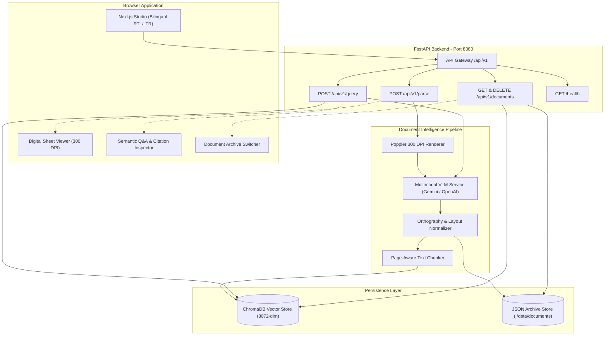

# KurdDocIntel — Kurdish Multimodal Document Intelligence & Semantic Search Studio

> High-precision Kurdish OCR, document parsing, structured metadata extraction, and grounded semantic search engineered for Kurdish books, publications, legal documents, and periodicals across Sorani and Kurmanji dialects.

---

## Table of Contents

- [Overview & Problem Statement](#overview--problem-statement)
- [Key Features](#key-features)
- [Tech Stack](#tech-stack)
- [Architecture & Data Flow](#architecture--data-flow)
  - [System Architecture](#system-architecture)
  - [Directory Structure](#directory-structure)
  - [Request Lifecycle](#request-lifecycle)
- [Prerequisites](#prerequisites)
- [Getting Started](#getting-started)
  - [1. Clone the Repository](#1-clone-the-repository)
  - [2. Backend Setup](#2-backend-setup)
  - [3. Frontend Setup](#3-frontend-setup)
  - [4. Verification](#4-verification)
- [Environment Variables](#environment-variables)
  - [Backend Variables](#backend-variables)
  - [Frontend Variables](#frontend-variables)
- [REST API Specification](#rest-api-specification)
- [Available Scripts](#available-scripts)
- [Testing & Quality Assurance](#testing--quality-assurance)
- [Production Deployment](#production-deployment)
  - [Docker & Docker Compose](#docker--docker-compose)
  - [Manual Production Deployment](#manual-production-deployment)
- [Troubleshooting & FAQ](#troubleshooting--faq)
- [Contributing Guidelines](#contributing-guidelines)
- [License](#license)

---

## Overview & Problem Statement

Kurdish printed and digital documents present formidable hurdles for traditional document processing and optical character recognition (OCR) systems:

1. **Complex Orthography and Non-Standard Diacritics:** Unique Kurdish letters (`ڵ`, `ڕ`, `ڤ`, `ۆ`, `ێ`, `ژ`, `پ`, `چ`, `گ`) and subtle vowel signs consistently degrade into gibberish or incorrect substitutions when run through generic Arabic OCR systems.
2. **Legacy Non-Unicode Fonts:** Tens of thousands of historical and modern publications remain encoded in legacy ASCII fonts (Ali-K, Dylan, Kurdish Standard) where character byte sequences do not map to valid Kurdish Unicode codepoints.
3. **Absence of Grounded Semantic Retrieval:** Traditional keyword search fails across Kurdish dialects (Sorani, Badini, Kurmanji) and cannot cross-reference visual evidence from complex two-column page layouts.

**KurdDocIntel** solves this by pairing multimodal Vision-Language Models (Gemini 2.5 Flash / Pro with OpenAI GPT-4o fallback) with high-resolution page rendering (300 DPI), page-aware semantic vector embeddings, and an interactive bilingual dual-pane research studio.

---

## Key Features

- **Multimodal Kurdish OCR (300 DPI):** Renders high-resolution image representations of uploaded documents to preserve fine Kurdish ligatures and diacritics before multimodal parsing.
- **Automated Metadata & Entity Extraction:** Extracts document title, publication date, detected dialect (Sorani, Kurmanji, Badini, Hawrami), document typology (book, legal, report, periodical), and prominent named entities.
- **Multi-Document Archive & Switcher:** Persistent storage of analyzed documents on disk (`data/documents/`) with automatic fallback to ChromaDB vector records. Allows users to switch between analyzed documents instantly without re-uploading.
- **In-App Archive Management:** Clear the entire indexed document archive or selectively delete individual documents directly from the user interface.
- **Grounded Semantic Q&A with Citation Highlighting:** Ask questions in Sorani, Kurmanji, or English. The studio returns answers backed by citations and includes a **Jump to passage** feature that highlights the exact excerpt and scrolls smoothly to the target page sheet.
- **Multi-Format Structured Export:** Export processed documents to formatted Markdown (`.md` with YAML frontmatter), Structured JSON (`.json`), or clean Plain Text (`.txt`).
- **Resilient Dual-Provider AI Pipeline:** Seamless primary execution via Google Gemini with automatic graceful fallback to OpenAI (GPT-4o) when quota or rate limits are reached.
- **Bilingual Interface Parity:** Instant one-click toggle between native Right-to-Left (RTL) Kurdish Sorani and Left-to-Right (LTR) English interfaces.

---

## Tech Stack

| Component | Technology | Version / Specification |
| --- | --- | --- |
| **Backend Framework** | FastAPI | Python 3.11+ (Python 3.13 supported) |
| **Server Gateway** | Uvicorn | ASGI High-Performance Server |
| **Data Validation** | Pydantic | Pydantic v2 Settings and Schemas |
| **Multimodal Primary** | Google Gemini API | `gemini-2.5-flash` / `gemini-2.5-pro` |
| **Multimodal Fallback** | OpenAI API | `gpt-4o` |
| **Embedding Model** | Gemini Multilingual | `gemini-embedding-2` (3072 dimensions) |
| **Vector Database** | ChromaDB | Persistent Client with Cosine Similarity |
| **Document Rendering** | pdf2image, Poppler | 300 DPI high-resolution rendering |
| **Image Processing** | Pillow (PIL) | RGB normalization & compression |
| **Frontend Framework** | Next.js (App Router) | Next.js 16.3+ with React 19 |
| **Styling & Layout** | Tailwind CSS | Bidirectional (`rtl` / `ltr`) layout system |
| **Icons & Design** | Lucide React | Clean icon set (strict zero-emoji policy) |
| **Containerization** | Docker, Compose | Multi-stage production container setup |

---

## Architecture & Data Flow

### System Architecture



### Directory Structure

```
kurd-doc-intel/
├── backend/
│   ├── app/
│   │   ├── api/
│   │   │   ├── __init__.py
│   │   │   └── endpoints.py          # FastAPI route handlers (parse, query, documents)
│   │   ├── core/
│   │   │   ├── __init__.py
│   │   │   ├── config.py             # Pydantic Settings (.env configuration)
│   │   │   └── schemas.py            # Request/Response models (ParseResponse, QueryResponse)
│   │   ├── services/
│   │   │   ├── __init__.py
│   │   │   ├── document_processor.py # PDF to 300 DPI image rendering via pdf2image
│   │   │   ├── vector_service.py     # ChromaDB indexing, querying, chunking
│   │   │   └── vlm_service.py        # Gemini & OpenAI multimodal OCR & Q&A logic
│   │   ├── __init__.py
│   │   └── main.py                   # FastAPI application initialization & CORS
│   ├── data/
│   │   ├── documents/                # Saved parsed document JSON records
│   │   └── uploads/                  # Temporary uploaded files
│   ├── chroma_db/                    # Persistent ChromaDB vector storage directory
│   ├── .env.example                  # Template backend environment variables
│   ├── Dockerfile                    # Backend container build specification
│   ├── requirements.txt              # Python production dependencies
│   └── test_monkey.py                # Retrieval and citation verification script
├── frontend/
│   ├── app/
│   │   ├── globals.css               # Tailwind theme, scrollbars, RTL base styles
│   │   ├── layout.tsx                # Root layout, fonts, bilingual HTML wrapper
│   │   └── page.tsx                  # Main single-page document intelligence studio
│   ├── public/                       # Static public web assets
│   ├── .env.local.example            # Template frontend environment variables
│   ├── Dockerfile                    # Frontend container build specification
│   ├── next.config.mjs               # Next.js configuration
│   ├── package.json                  # Node.js dependencies and run scripts
│   ├── postcss.config.mjs            # PostCSS configuration
│   └── tsconfig.json                 # TypeScript compiler configuration
├── .gitignore                        # Git exclusion rules
├── docker-compose.yml                # Multi-container orchestration specification
├── DEVELOPMENT.md                    # In-depth technical developer reference
└── README.md                         # Main documentation
```

### Request Lifecycle

1. **Document Upload (`POST /api/v1/parse`):**
   - User uploads a PDF or image file and sets the page processing limit (or selects all pages).
   - `document_processor.py` renders PDF pages into 300 DPI Pillow images via Poppler.
   - `vlm_service.py` sends the rendered images with specialized Kurdish orthography prompts to Google Gemini (or OpenAI if Gemini quota is unavailable).
   - The returned response contains structured Markdown text, document title, dialect, summary, and detected entities.
   - `vector_service.py` cleans headers, breaks text into overlapping chunks, computes dense multilingual embeddings (`gemini-embedding-2`), and indexes them into ChromaDB.
   - The full result is persisted as a JSON record in `data/documents/{document_id}.json`.

2. **Semantic Search & Grounded Q&A (`POST /api/v1/query`):**
   - The user inputs a query in Kurdish or English.
   - `vector_service.py` executes a semantic similarity query against ChromaDB, optionally scoped to active document IDs.
   - The top matching chunks and source citations are formatted into an evidence context.
   - The VLM generates an evidence-grounded answer citing specific document chunks and pages.

3. **Archive Switching (`GET /api/v1/documents` & `GET /api/v1/documents/{id}`):**
   - The header displays the active archive count. Clicking the archive dropdown lists all past documents.
   - Selecting a document instantly loads its stored transcription and metadata into the studio without invoking the AI parser or requiring file re-upload.

---

## Prerequisites

Before setting up KurdDocIntel, verify that your development machine has the following tools installed:

- **Python:** Version 3.11 or higher (Python 3.13 tested).
- **Node.js:** Version 18.0 or higher (with npm or pnpm).
- **Poppler:** Essential for PDF rendering:
  - **Windows:** Install Poppler (e.g., via conda-forge or GitHub releases) and add `bin/` to system `PATH`.
  - **macOS:** `brew install poppler`
  - **Linux (Ubuntu/Debian):** `sudo apt-get install -y poppler-utils`
- **Google Gemini API Key:** Required for multimodal document parsing and multilingual vector embeddings.
- **OpenAI API Key (Optional):** Used as automated fallback if Gemini reaches rate limits.

---

## Getting Started

### 1. Clone the Repository

```bash
git clone https://github.com/ahmadw13/kurd-doc-intel.git
cd kurd-doc-intel
```

### 2. Backend Setup

```bash
cd backend

# Create virtual environment
python -m venv venv

# Activate virtual environment
# Windows (PowerShell):
.\venv\Scripts\Activate.ps1
# Linux / macOS:
source venv/bin/activate

# Install dependencies
pip install -r requirements.txt

# Configure environment variables
cp .env.example .env
# Open .env and insert your GEMINI_API_KEY (and OPENAI_API_KEY if desired)

# Start development server
uvicorn app.main:app --host 127.0.0.1 --port 8080 --reload
```

The backend interactive OpenAPI documentation will be accessible at [http://127.0.0.1:8080/docs](http://127.0.0.1:8080/docs).

### 3. Frontend Setup

In a separate terminal window:

```bash
cd frontend

# Install Node dependencies
npm install

# Start Next.js development server
npm run dev
```

Open [http://localhost:3000](http://localhost:3000) in your web browser.

### 4. Verification

Test the backend health check endpoint:

```bash
curl http://127.0.0.1:8080/health
```

Expected JSON response:
```json
{
  "status": "healthy",
  "service": "KurdDocIntel Backend",
  "version": "0.1.0",
  "ai_provider": "gemini"
}
```

---

## Environment Variables

### Backend Variables

Configure these settings in `backend/.env`:

| Variable | Description | Default | Required |
| --- | --- | --- | --- |
| `GEMINI_API_KEY` | Google Gemini API key for multimodal parsing and embeddings | None | Yes |
| `OPENAI_API_KEY` | OpenAI API key for fallback OCR and Q&A | None | Optional |
| `DEFAULT_VLM_PROVIDER` | Primary AI provider (`gemini` or `openai`) | `gemini` | Yes |
| `GEMINI_VLM_MODEL` | Gemini vision model identifier | `gemini-2.5-flash` | Yes |
| `OPENAI_VLM_MODEL` | OpenAI vision model identifier | `gpt-4o` | Optional |
| `CHROMA_PERSIST_DIR` | Directory where ChromaDB indexes are stored | `./chroma_db` | Yes |
| `DOCUMENTS_DIR` | Directory where parsed document JSONs are saved | `./data/documents` | Yes |
| `UPLOAD_DIR` | Temporary upload scratch directory | `./data/uploads` | Yes |
| `HOST` | Backend listener binding host | `127.0.0.1` | Yes |
| `PORT` | Backend listener port | `8080` | Yes |

### Frontend Variables

Configure these settings in `frontend/.env.local`:

| Variable | Description | Default | Required |
| --- | --- | --- | --- |
| `NEXT_PUBLIC_API_URL` | Base URL of the running FastAPI backend | `http://127.0.0.1:8080` | Optional |

---

## REST API Specification

### Endpoints Overview

| Method | Endpoint | Description |
| --- | --- | --- |
| `GET` | `/health` | Health status and active AI provider inspection |
| `POST` | `/api/v1/parse` | High-resolution multimodal OCR & metadata extraction |
| `POST` | `/api/v1/query` | Grounded semantic search across indexed documents |
| `GET` | `/api/v1/documents` | List all archived documents with metadata |
| `GET` | `/api/v1/documents/{id}` | Retrieve complete transcription for a specific document |
| `DELETE` | `/api/v1/documents` | Clear the entire document archive and vector store |
| `DELETE` | `/api/v1/documents/{id}` | Delete an individual document and its embeddings |

### Example Document Parse Request

```bash
curl -X POST "http://127.0.0.1:8080/api/v1/parse?max_pages=3" \
  -H "accept: application/json" \
  -H "Content-Type: multipart/form-data" \
  -F "file=@sample_book.pdf;type=application/pdf"
```

---

## Available Scripts

### Backend Commands

| Command | Working Directory | Description |
| --- | --- | --- |
| `uvicorn app.main:app --reload --port 8080` | `backend/` | Start backend in development mode with live code reload |
| `uvicorn app.main:app --host 0.0.0.0 --port 8080 --workers 4` | `backend/` | Start backend in multi-worker production mode |
| `python test_monkey.py` | `backend/` | Run integration tests against sample indexed documents |

### Frontend Commands

| Command | Working Directory | Description |
| --- | --- | --- |
| `npm run dev` | `frontend/` | Start Next.js local development server on port 3000 |
| `npm run build` | `frontend/` | Compile optimized Next.js production build |
| `npm run start` | `frontend/` | Run compiled Next.js production server |
| `npm run lint` | `frontend/` | Run ESLint static code verification |

---

## Testing & Quality Assurance

### Testing Retrieval Quality

To verify semantic similarity and Kurdish grounded citation accuracy:

```bash
cd backend
python -m unittest discover -s tests -p "test_*.py"
```

### Verifying Frontend Build & Types

```bash
cd frontend
npm run build
```

The Next.js build validates TypeScript typings and compiles static and dynamic pages with zero warnings.

---

## Production Deployment

### Docker & Docker Compose

The fastest way to deploy KurdDocIntel in production is using Docker Compose:

```bash
# Set your API keys in backend/.env
cp backend/.env.example backend/.env

# Build and launch both containers in detached mode
docker compose up -d --build

# Inspect running container logs
docker compose logs -f

# Stop containers
docker compose down
```

### Manual Production Deployment

1. **Backend:**
   ```bash
   cd backend
   source venv/bin/activate
   pip install -r requirements.txt
   uvicorn app.main:app --host 0.0.0.0 --port 8080 --workers 4
   ```

2. **Frontend:**
   ```bash
   cd frontend
   npm install
   npm run build
   npm run start -p 3000
   ```

---

## Troubleshooting & FAQ

### 1. `pdf2image.exceptions.PDFInfoNotInstalledError`
- **Cause:** Poppler binary is not found on your system execution PATH.
- **Remedy:** Install Poppler using your package manager (`brew install poppler` on macOS, `apt-get install poppler-utils` on Linux, or download Poppler for Windows) and confirm `pdftoppm -v` runs from your shell.

### 2. HTTP 429 / Resource Exhausted Errors
- **Cause:** Google Gemini free-tier or per-minute rate limits reached.
- **Remedy:** The backend automatically attempts fallback to OpenAI if `OPENAI_API_KEY` is provided in `.env`. Alternatively, reduce the `max_pages` count or pause for 60 seconds before retrying.

### 3. Missing Ligatures or Kurdish Digit Anomalies
- **Cause:** Legacy non-standard fonts used in old publications.
- **Remedy:** KurdDocIntel uses high-resolution visual parsing rather than standard text layer extraction, which bypasses faulty legacy font encodings. Verify that the image DPI is set to at least 300 DPI.

---

## Contributing Guidelines

1. **Zero-Emoji Policy:** Do not use emojis anywhere in source code, user interface components, commit messages, or markdown documentation.
2. **Kurdish Unicode Standards:** Strictly utilize standard Kurdish Unicode codepoints (such as `ڵ` U+06B5, `ڕ` U+0695, `ێ` U+06CE, `ۆ` U+06C6).
3. **Bilingual Parity:** Any new user interface element must include localized strings for both Kurdish Sorani (`ckb`) and English (`en`) with bidirectional layout support.

---

## License

This project is licensed under the MIT License. See [LICENSE](LICENSE) for details.
