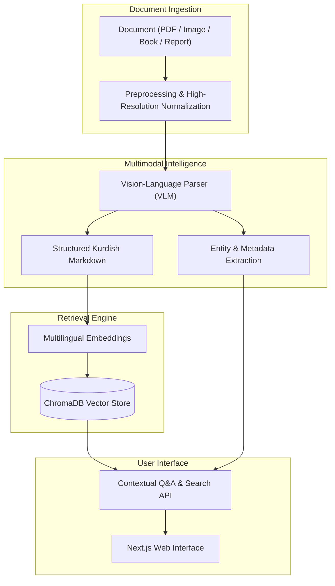

# KurdDocIntel — Kurdish Multimodal Document Intelligence & Semantic Search

> High-precision Kurdish OCR, document parsing, entity extraction, and semantic search engineered for Kurdish books, publications, reports, and digital documents across Sorani & Kurmanji dialects.

---

## Context & Problem Statement
Kurdish digital and printed documents present unique challenges for traditional OCR and retrieval pipelines:
- Complex ligatures, non-standard diacritics, and distinctive Kurdish characters (ڵ, ڕ, ڤ, ۆ, ێ, ژ, پ, چ, گ).
- Documents rendered in non-Unicode legacy ASCII fonts that break standard text extraction.
- A lack of multilingual semantic search and RAG systems tailored to Kurdish text structures and vocabulary.

KurdDocIntel addresses this by pairing state-of-the-art Vision-Language Models (VLMs) with specialized document prompting and a multilingual vector retrieval engine.

---

## Architecture

---

## Key Capabilities
- **High-Fidelity Kurdish OCR:** Converts printed books, scanned pages, and articles into clean, standard Kurdish Unicode markdown.
- **Structured Metadata & Entity Extraction:** Automatically detects document title, dialect, publication details, and prominent entities.
- **Multilingual Semantic Q&A (RAG):** Ask questions in Kurdish (Sorani/Kurmanji) or English and get grounded answers with source citations.
- **Interactive Conversational UI:** Full dual-pane view with live OCR markdown and conversational document chat.

---

## Tech Stack
- **Backend:** FastAPI (Python 3.13), Pydantic
- **AI / Multimodal:** Vision-Language Models (Gemini / OpenAI VLM), Text Embeddings
- **Retrieval:** ChromaDB vector store
- **Frontend:** Next.js, Tailwind CSS, Lucide Icons, RTL Kurdish Typography
- **Containerization:** Docker & Docker Compose
